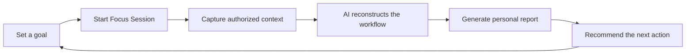
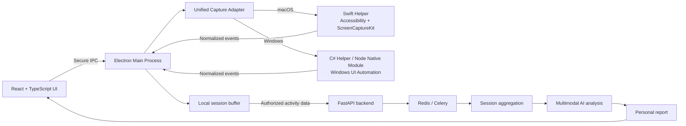

# Mirror

### Not just how long you work—how effectively you reach your goal.

[](#Mirror-china)
[](#core-capabilities)
[](#technology)
[](#privacy-by-design)
[](LICENSE)

[简体中文](README.md) · **English** · [Русский](README.ru.md)

> **Mirror** is a desktop work-intelligence assistant for knowledge workers. It analyzes goal-oriented work sessions, identifies focus patterns, bottlenecks, and context switching, then recommends a concrete, personalized improvement for the next session.

## Project highlights

- **Goal-driven, not time-driven:** measures whether work actually moves a goal forward.
- **From data to action:** every session produces a clear conclusion and next step.
- **Continuous personalization:** AI builds an individual work-behavior model from session history.
- **Positive gamification:** Mirror Character turns real improvement into visible progress.
- **Privacy by design:** authorized context is captured only during a session started by the user.

## The problem

Traditional productivity tools count screen time, application usage, or completed tasks. They cannot answer the questions that matter most:

> Why did I fail to finish? Where did my time go? What should I change next time?

For students, developers, designers, researchers, creators, and founders, output is often limited not by available hours but by behavioral patterns: research overrun, excessive context switching, interrupted attention, or an inability to stop polishing.

Mirror transforms fragmented work signals into personal insights that are understandable, comparable, and actionable.

## How it works

The user begins with a clear goal, for example:

> **“Finish the Mirror pitch deck in 90 minutes.”**

They then launch a Focus Session. Within the permissions they control, Mirror captures applications, windows, websites, activity periods, and task switches. When the session ends, AI reconstructs the workflow and generates a personal report.



## Core capabilities

| Insight | Value |
|---|---|
| Goal Completion | Shows whether effort became a measurable outcome |
| Focus Score | Quantifies the quality of concentration |
| Deep Work Time | Identifies the highest-value working periods |
| Context Switching | Reveals the cost of fragmented attention |
| Bottlenecks | Finds where and why progress slowed down |
| Distractions | Separates useful exploration from noise |
| AI Insights | Detects recurring patterns of behavior |
| Next Session Advice | Converts analysis into one immediate action |

### Example report

> **Goal:** Finish the presentation<br>
> **Goal Completion:** 92%<br>
> **Focus Score:** 78/100<br>
> **Main bottleneck:** Research overrun<br>
> **Detected:** 7 similar searches after enough information had been found<br>
> **AI advice:** Define a “research complete” criterion before the next session.

## A personal AI work coach

Mirror compares sessions and gradually understands each person's unique way of working:

`Research overrun → perfectionism → context switching → reduced execution`

Instead of generic advice like “avoid distractions,” the system can provide feedback grounded in personal history:

> In your last five sessions, long research periods made it harder to return to the main task. Limit research to the first 20 minutes next time.

The more Mirror is used, the more accurate the personal work model and its recommendations become.

## Mirror Character

Every user has a virtual character that reflects their working style. It develops through high-quality Focus Sessions—not simply by spending more hours online.

| Attribute | What it represents |
|---|---|
| Focus | Ability to maintain concentration |
| Stamina | Ability to sustain effective work |
| Execution | Ability to turn intent into a finished result |
| Discipline | Resistance to irrelevant distractions |
| Adaptability | Ability to switch effectively when needed |
| Energy | Current overall working condition |

```text
90 min Focus Session Completed
Goal Completion: 92%
+120 XP  ·  Focus +2  ·  Execution +3  ·  Stamina +1
```

Mirror Character increases engagement while turning a complex personal AI model into intuitive, human-readable feedback.

## Users and use cases

### Target users

- university students and researchers;
- developers, designers, and product managers;
- content creators and writers;
- founders and independent professionals;
- knowledge workers whose output depends on deep focus.

### Core use cases

- exam and thesis preparation;
- programming and product development;
- design and content production;
- research, writing, and information synthesis;
- pitch deck and presentation creation;
- complex, deadline-driven work.

## Product value

| For individuals | For education and innovation | For future team collaboration |
|---|---|---|
| Understand how they actually work | Build sustainable focus habits | Offer privacy-safe aggregate insights with consent |
| Turn reflection into a next action | Make improvement visible and measurable | Focus on work quality rather than surveillance |
| Improve through personal guidance | Support project-based learning | Improve collaboration rhythm and work wellbeing |

## How Mirror is different

| Capability | Timer | Website blocker | Task manager | Mirror |
|---|:---:|:---:|:---:|:---:|
| Track work duration | ✓ | — | — | ✓ |
| Manage goals | — | — | ✓ | ✓ |
| Understand work context | — | — | — | ✓ |
| Identify behavioral bottlenecks | — | — | — | ✓ |
| Provide personalized AI advice | — | — | — | ✓ |
| Build a long-term behavior model | — | — | — | ✓ |
| Reward quality-based progress | — | — | — | ✓ |

## Mirror China

Mirror was built for the **Mirror China innovation and entrepreneurship competition/product project**. It brings together multimodal AI, human-centered design, behavioral analytics, privacy engineering, and meaningful gamification.

The project validates one focused hypothesis:

> If AI can reconstruct how a goal-oriented work session unfolded, it can deliver one personalized recommendation valuable enough to improve the next session.

### Live demo flow

1. Set an Mirror-related work goal.
2. Start and complete a Focus Session.
3. Review Goal Completion, Focus Score, and the main bottleneck.
4. Receive personalized AI advice.
5. See the resulting Mirror Character progress.

This flow demonstrates technical capability, user value, and product completeness in one clear, measurable loop.

## Technology

| Layer | Technology |
|---|---|
| Desktop runtime | Electron (Main Process, Preload, IPC) |
| UI | React, TypeScript |
| Shared contracts | TypeScript types, normalized event model, and platform adapter interfaces |
| macOS capture | Swift Helper, Accessibility API, ScreenCaptureKit |
| Windows capture | C#/.NET Helper with Windows UI Automation; optional Node-API native module for performance-sensitive features |
| Backend | Python, FastAPI |
| Database | PostgreSQL |
| Storage | S3-compatible object storage |
| Processing | Redis, Celery |
| AI | Multimodal LLM for work-context understanding |



### Desktop module boundaries

- **React Renderer** owns the interface, session controls, and report presentation; it never accesses system APIs directly.
- **Preload Bridge** exposes only an allowlisted set of IPC methods to the UI.
- **Electron Main Process** manages the session lifecycle, local buffering, permission state, and native helper processes.
- **Capture Adapter** hides platform differences behind one TypeScript interface.
- **Swift / C# Helpers** perform permission-sensitive system capture and return normalized events only.
- **Node Native Module** is an optional Windows implementation for features requiring lower latency or direct system API access.

This separation allows the UI and system-capture layers to be developed and tested independently and makes additional platforms easier to support. Session data is aggregated locally and sent for AI analysis only after the user finishes the session, keeping the privacy boundary clear and controllable.

See the [Architecture Documentation](docs/ARCHITECTURE.md) for complete module boundaries, trust rules, and extension guidelines.

### Local development

```bash
npm install
npm run build:native:macos
npm run dev
```

On Windows, build the C# Helper with `npm run build:native:windows`. Run `npm run typecheck`, `npm test`, and `npm run build` for the complete project verification suite.

Docker provides reproducible CI verification and Electron bundle builds: `docker build -f apps/desktop/Dockerfile --target verify .`. Swift and C# Helpers are still built and signed on their target operating systems.

Docker Compose is also available: run `docker compose build desktop-build` for the artifact image or `docker compose --profile verify build desktop-verify` for containerized verification.

## Privacy by design

Trust is a core product principle.

- capture runs only inside a Focus Session explicitly started by the user;
- no keylogging;
- application and website blacklists;
- private and incognito contexts are excluded;
- protected transfer and controlled storage;
- screenshots can be deleted automatically after processing;
- users can view, manage, and delete their session history;
- Mirror is not designed as an employee surveillance tool.

## Roadmap

| Stage | Product outcome |
|---|---|
| 1. Understand | Explain how the user actually works |
| 2. Personalize | Build a continuously learning personal work model |
| 3. Improve | Turn better habits into visible progress |
| 4. Assist | Provide timely help through a Live AI Coach |

Further development expands platform support and introduces deeper integrations with browsers, VS Code, Figma, Notion, Office, Jira, Linear, long-term trend analysis, and real-time AI guidance.

## Vision

### Mirror = Work Analytics + Personal AI Coach + Gamification

Mirror is designed to become a trusted intelligence layer for personal work: a digital mirror that helps people understand their behavior, make better decisions, and improve continuously—without rewarding longer hours or burnout.

## License and copyright

This project is available under the [MIT License](LICENSE). Copyright © 2026 Alekseenko Denis. See [COPYRIGHT](COPYRIGHT) for details.

---

<p align="center"><strong>Built for Mirror China · Understand your work. Improve your next session.</strong></p>
