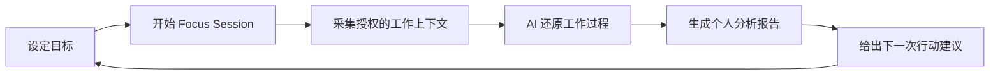
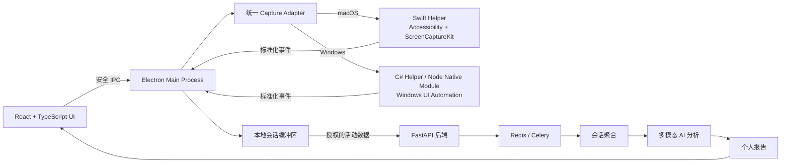

# Mirror

### 不只是记录你工作了多久，更理解你如何完成目标。

[](#Mirror-china)
[](#核心能力)
[](#技术架构)
[](#隐私保护)
[](LICENSE)

**简体中文** · [English](README.en.md) · [Русский](README.ru.md)

> **Mirror** 是一款面向知识工作者的桌面端个人工作智能助手。它通过分析目标导向型工作会话，识别专注模式、效率瓶颈与任务切换行为，并为下一次工作提供具体、个性化的改进建议。

## 项目亮点

- **目标驱动，而非时间驱动**：衡量工作是否真正推动目标完成。
- **从数据到行动**：每次会话都输出清晰结论和下一步建议。
- **持续个性化**：AI 根据历史会话建立个人工作行为模型。
- **正向游戏化**：Mirror Character 将真实成长转化为可见进步。
- **隐私设计先行**：只有用户主动开启会话时才采集授权数据。

## 我们解决的问题

传统效率工具通常只统计屏幕时间、应用使用时长或任务数量，却无法回答更重要的问题：

> 我为什么没有完成目标？时间究竟浪费在哪里？下一次应该改变什么？

对学生、开发者、设计师、研究人员、创作者和创业者而言，真正影响产出的往往不是工作时长，而是过度调研、频繁切换、注意力中断和无法及时结束任务等行为模式。

Mirror 将碎片化的工作信号转化为可理解、可比较、可改善的个人洞察。

## 产品如何工作

用户首先设定一个明确目标，例如：

> **“在 90 分钟内完成 Mirror 路演演示文稿。”**

然后启动 Focus Session。Mirror 在授权范围内记录应用、窗口、网站、活跃时段和任务切换。会话结束后，AI 还原工作过程并生成个人报告。



## 核心能力

| 分析维度 | 带来的价值 |
|---|---|
| Goal Completion | 判断投入是否真正转化为目标成果 |
| Focus Score | 量化本次会话的专注质量 |
| Deep Work Time | 识别高价值的深度工作时段 |
| Context Switching | 揭示注意力碎片化及其影响 |
| Bottlenecks | 找出进度停滞的位置和原因 |
| Distractions | 区分必要探索与无效干扰 |
| AI Insights | 发现重复出现的工作行为模式 |
| Next Session Advice | 将分析转化为一个可立即执行的动作 |

### 报告示例

> **目标：**完成演示文稿<br>
> **目标完成度：**92%<br>
> **专注得分：**78/100<br>
> **主要瓶颈：**调研超时<br>
> **检测结果：**获得足够信息后仍进行了 7 次相似搜索<br>
> **AI 建议：**下一次会话开始前，先定义“调研完成”的标准。

## 个性化 AI 工作教练

Mirror 会对比多次会话，逐渐理解每个人独特的工作方式：

`调研超时 → 完美主义 → 频繁切换 → 执行效率下降`

因此，系统不会只给出“少分心”这样的通用建议，而是提供基于个人历史的反馈：

> 在最近 5 次会话中，长时间调研后你更难回到主任务。下一次请将调研限制在前 20 分钟。

使用越多，个人工作模型越准确，建议也越贴近真实需求。

## Mirror Character

每位用户都拥有一个代表自己工作风格的虚拟角色。角色通过高质量 Focus Session 成长，而不是通过单纯增加在线时长升级。

| 属性 | 所代表的能力 |
|---|---|
| Focus 专注 | 持续保持注意力的能力 |
| Stamina 耐力 | 长时间维持高效工作的能力 |
| Execution 执行 | 将目标转化为完成结果的能力 |
| Discipline 自律 | 抵抗无关干扰的能力 |
| Adaptability 适应 | 在必要时高效切换任务的能力 |
| Energy 能量 | 当前整体工作状态 |

```text
90 min Focus Session Completed
Goal Completion: 92%
+120 XP  ·  Focus +2  ·  Execution +3  ·  Stamina +1
```

Mirror Character 不仅提升参与感，也将复杂的个人 AI 模型转化为直观、易懂的成长反馈。

## 目标用户与应用场景

### 目标用户

- 大学生与研究生
- 开发者、设计师与产品经理
- 研究人员与内容创作者
- 创业者与自由职业者
- 依赖深度专注创造价值的知识工作者

### 核心场景

- 考试与论文准备
- 编程与产品开发
- 设计与内容创作
- 调研、写作与资料整理
- 路演材料和演示文稿制作
- 有明确截止时间的复杂任务

## 产品价值

| 对个人 | 对教育与创新生态 | 对未来团队协作 |
|---|---|---|
| 更清楚地理解自己的工作方式 | 帮助学生建立可持续的专注习惯 | 在用户授权下提供隐私安全的聚合洞察 |
| 将复盘转化为下一步行动 | 让成长过程更加直观和可衡量 | 关注工作质量，而不是员工监控 |
| 通过个性化建议持续改善 | 支持项目制学习和创新实践 | 改善协作节奏与工作健康 |

## 与传统工具的区别

| 能力 | 计时器 | 网站拦截器 | 任务管理工具 | Mirror |
|---|:---:|:---:|:---:|:---:|
| 记录工作时长 | ✓ | — | — | ✓ |
| 管理任务 | — | — | ✓ | ✓ |
| 理解工作上下文 | — | — | — | ✓ |
| 识别行为瓶颈 | — | — | — | ✓ |
| 个性化 AI 建议 | — | — | — | ✓ |
| 长期行为模型 | — | — | — | ✓ |
| 基于质量的游戏化成长 | — | — | — | ✓ |

## Mirror China

Mirror 是为 **Mirror 中国产品创新 / 产品**打造的产品项目，融合多模态 AI、人本设计、行为分析、隐私工程和游戏化体验。

项目验证的核心命题是：

> 如果 AI 能还原一次目标导向型工作会话，它就能给出一条足够有价值的个性化建议，让下一次会话更高效。

### 现场演示流程

1. 设置与 Mirror 相关的工作目标。
2. 开启并完成一次 Focus Session。
3. 查看 Goal Completion、Focus Score 和关键瓶颈。
4. 获取 AI 个性化建议。
5. 查看 Mirror Character 的成长结果。

这一流程将技术能力、用户价值和产品完整性集中呈现在一个清晰、可衡量的闭环中。

## 技术架构

| 层级 | 技术方案 |
|---|---|
| Desktop Runtime | Electron（Main Process、Preload、IPC） |
| UI | React、TypeScript |
| Shared Contracts | TypeScript 类型、统一事件模型与平台适配器接口 |
| macOS Capture | Swift Helper、Accessibility API、ScreenCaptureKit |
| Windows Capture | C#/.NET Helper、Windows UI Automation；高性能场景可使用 Node-API Native Module |
| Backend | Python、FastAPI |
| Database | PostgreSQL |
| Storage | S3 兼容对象存储 |
| Processing | Redis、Celery |
| AI | 用于工作上下文理解的多模态大模型 |



### Desktop 模块边界

- **React Renderer** 只负责界面、会话控制和报告展示，不直接访问系统 API。
- **Preload Bridge** 仅向 UI 暴露经过白名单控制的 IPC 方法。
- **Electron Main Process** 管理会话生命周期、本地缓冲、权限状态和 Native Helper 进程。
- **Capture Adapter** 将 macOS 与 Windows 的平台差异封装为统一 TypeScript 接口。
- **Swift / C# Helper** 负责需要原生权限的系统采集，并只返回标准化事件。
- **Node Native Module** 作为 Windows 可选实现，用于需要更低延迟或直接调用系统 API 的模块。

这种分层让 UI 与系统采集能力可以独立开发和测试，也便于未来增加新的平台。会话数据先在本地聚合，只在用户结束会话后发送到后端进行 AI 分析，使隐私边界保持清晰可控。

完整的模块边界、信任模型和扩展规则请参阅 [Architecture Documentation](docs/ARCHITECTURE.md)。

### 本地开发

```bash
npm install
npm run build:native:macos
npm run dev
```

Windows 开发环境使用 `npm run build:native:windows` 构建 C# Helper。运行 `npm run typecheck`、`npm test` 和 `npm run build` 可完成项目检查。

Docker 可用于可重复的 CI 检查和 Electron bundle 构建：`docker build -f apps/desktop/Dockerfile --target verify .`。Swift 与 C# Helper 仍需在对应的目标操作系统上构建和签名。

也可以通过 Docker Compose 构建：`docker compose build desktop-build`。使用 `docker compose --profile verify build desktop-verify` 运行容器化检查。

## 隐私保护

信任是 Mirror 的核心产品原则。

- 仅在用户主动开始的 Focus Session 中运行；
- 不记录键盘输入，不进行 keylogging；
- 支持应用与网站黑名单；
- 排除隐私和无痕浏览环境；
- 数据安全传输并受控存储；
- 截图可在处理后自动删除；
- 用户可查看、管理和删除自己的会话历史；
- 不将产品设计为员工监控工具。

## 发展路线

| 阶段 | 产品成果 |
|---|---|
| 1. Understand | 让用户理解自己真实的工作方式 |
| 2. Personalize | 建立持续学习的个人工作模型 |
| 3. Improve | 将更好的习惯转化为可见成长 |
| 4. Assist | 通过 Live AI Coach 在关键时刻提供帮助 |

后续将扩展至更多平台，并深度集成浏览器、VS Code、Figma、Notion、Office、Jira、Linear 等专业工具，进一步提供长期趋势分析和实时 AI 指导。

## 愿景

### Mirror = 工作分析 + 个人 AI 教练 + 游戏化成长

Mirror 希望成为值得信赖的个人工作智能层：像一面数字镜子，帮助每个人理解自己的行为、做出更好的决策并持续进步，而不是鼓励更长的工作时间和过度消耗。

## 许可与版权

本项目采用 [MIT License](LICENSE)。版权所有 © 2026 Alekseenko Denis。更多信息请参阅 [COPYRIGHT](COPYRIGHT)。

---

<p align="center"><strong>Built for Mirror China · Understand your work. Improve your next session.</strong></p>
