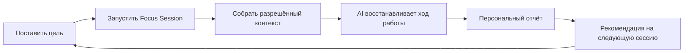
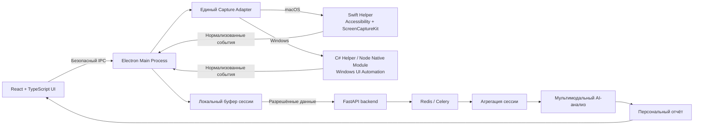

# Mirror

### Не просто считает рабочее время, а помогает эффективнее достигать целей.

[](#история-продукта)
[](#ключевые-возможности)
[](#технологии)
[](#приватность-по-умолчанию)
[](LICENSE)

[简体中文](README.md) · [English](README.en.md) · **Русский**

> **Mirror** — desktop-приложение персональной рабочей аналитики для специалистов умственного труда. Оно анализирует целевые рабочие сессии, находит паттерны концентрации, барьеры и переключения между задачами, а затем предлагает конкретное персональное улучшение для следующей сессии.

## Главное о проекте

- **Цель важнее времени:** продукт оценивает, помогла ли работа приблизиться к результату.
- **От данных к действию:** каждая сессия заканчивается понятным выводом и следующим шагом.
- **Постоянная персонализация:** AI строит индивидуальную модель рабочего поведения.
- **Позитивная геймификация:** Mirror Character превращает реальные улучшения в видимый прогресс.
- **Privacy by design:** разрешённый контекст собирается только во время добровольно запущенной сессии.

## Проблема

Обычные productivity-инструменты считают экранное время, использование приложений и закрытые задачи. Но они не отвечают на вопросы, которые действительно влияют на результат:

> Почему я не закончил задачу? Куда ушло время? Что изменить в следующий раз?

Для студентов, разработчиков, дизайнеров, исследователей, авторов и предпринимателей результат часто ограничивают не доступные часы, а паттерны поведения: затянувшийся research, постоянные переключения, прерывания внимания или бесконечная доработка деталей.

Mirror превращает разрозненные рабочие сигналы в понятные, сопоставимые и применимые персональные выводы.

## Как это работает

Пользователь начинает с ясной цели, например:

> **«За 90 минут закончить презентацию продукта».**

Затем он запускает Focus Session. В рамках выданных разрешений Mirror фиксирует приложения, окна, сайты, периоды активности и переключения между задачами. После завершения сессии AI восстанавливает ход работы и формирует персональный отчёт.



## Ключевые возможности

| Результат анализа | Практическая ценность |
|---|---|
| Goal Completion | Показывает, превратились ли усилия в измеримый результат |
| Focus Score | Оценивает качество концентрации |
| Deep Work Time | Выделяет наиболее ценные периоды работы |
| Context Switching | Показывает цену фрагментации внимания |
| Bottlenecks | Находит, где и почему замедлился прогресс |
| Distractions | Отделяет полезный поиск от отвлечений |
| AI Insights | Обнаруживает повторяющиеся паттерны поведения |
| Next Session Advice | Превращает анализ в одно конкретное действие |

### Пример отчёта

> **Цель:** закончить презентацию<br>
> **Выполнение цели:** 92%<br>
> **Focus Score:** 78/100<br>
> **Главный барьер:** затянувшийся research<br>
> **Обнаружено:** 7 похожих запросов после того, как нужная информация уже была найдена<br>
> **Совет AI:** до следующей сессии определить критерий завершения research.

## Персональный AI-коуч

Mirror сравнивает сессии и постепенно понимает индивидуальный способ работы:

`Затянувшийся research → перфекционизм → переключения → снижение результативности`

Вместо общего совета «меньше отвлекайся» система даёт обратную связь на основе личной истории:

> В последних пяти сессиях после долгого research тебе было сложнее вернуться к основной задаче. В следующий раз ограничь исследование первыми 20 минутами.

Чем больше пользователь работает с Mirror, тем точнее становится его персональная модель и рекомендации.

## Mirror Character

У каждого пользователя есть виртуальный персонаж, отражающий его стиль работы. Он развивается благодаря качественным Focus Sessions, а не простому увеличению времени онлайн.

| Характеристика | Что она отражает |
|---|---|
| Focus | Способность сохранять концентрацию |
| Stamina | Способность долго работать без потери эффективности |
| Execution | Способность превращать намерение в результат |
| Discipline | Устойчивость к нерелевантным отвлечениям |
| Adaptability | Способность эффективно переключаться, когда это необходимо |
| Energy | Текущее общее рабочее состояние |

```text
90 min Focus Session Completed
Goal Completion: 92%
+120 XP  ·  Focus +2  ·  Execution +3  ·  Stamina +1
```

Mirror Character повышает вовлечённость и делает сложную персональную AI-модель простой и наглядной.

## Пользователи и сценарии

### Целевая аудитория

- студенты и исследователи;
- разработчики, дизайнеры и продакт-менеджеры;
- авторы и создатели контента;
- основатели стартапов и независимые специалисты;
- специалисты, чья результативность зависит от глубокого фокуса.

### Основные сценарии

- подготовка к экзаменам и работа над дипломом;
- программирование и разработка продуктов;
- дизайн и производство контента;
- исследования, написание текстов и сбор материалов;
- создание презентаций и pitch deck;
- сложные задачи с жёстким дедлайном.

## Ценность продукта

| Для человека | Для образования и инноваций | Для будущей командной работы |
|---|---|---|
| Понимание реального стиля работы | Формирование устойчивых навыков фокуса | Безопасные агрегированные инсайты с согласия пользователей |
| Превращение рефлексии в действие | Наглядный и измеримый прогресс | Оценка качества работы, а не слежка |
| Улучшение через личные рекомендации | Поддержка проектного обучения | Более здоровый ритм совместной работы |

## Отличия от традиционных инструментов

| Возможность | Таймер | Блокировщик сайтов | Task manager | Mirror |
|---|:---:|:---:|:---:|:---:|
| Учёт рабочего времени | ✓ | — | — | ✓ |
| Управление целями | — | — | ✓ | ✓ |
| Понимание рабочего контекста | — | — | — | ✓ |
| Поиск поведенческих барьеров | — | — | — | ✓ |
| Персональные AI-рекомендации | — | — | — | ✓ |
| Долгосрочная модель поведения | — | — | — | ✓ |
| Игровой прогресс за качество работы | — | — | — | ✓ |

## История продукта

Современная интеллектуальная работа наполнена инструментами, уведомлениями и постоянными переключениями. При этом человеку всё ещё сложно понять, почему сегодня он был продуктивен или почему цель осталась незавершённой после нескольких часов работы. Mirror появился именно для решения этого разрыва: не как ещё один таймер, а как цифровое отражение реального рабочего поведения.

В основе продукта лежит одна ясная идея:

> Если AI может восстановить ход рабочей сессии, направленной на конкретную цель, он сможет дать одну достаточно ценную персональную рекомендацию, чтобы улучшить следующую сессию.

### Полный продуктовый сценарий

1. Поставить ясную и измеримую рабочую цель.
2. Запустить и завершить Focus Session.
3. Посмотреть Goal Completion, Focus Score и главный барьер.
4. Получить персональный совет AI.
5. Увидеть прогресс Mirror Character.

Этот сценарий соединяет намерение, реальное поведение, AI-инсайт и постоянное улучшение в единый цикл. Ценность Mirror не в том, чтобы собирать больше данных, а в том, чтобы помочь человеку понять одну рабочую сессию и сделать следующую лучше.

## Технологии

| Уровень | Технологии |
|---|---|
| Desktop Runtime | Electron: Main Process, Preload и IPC |
| UI | React, TypeScript |
| Общие контракты | TypeScript-типы, единая модель событий и интерфейсы платформенных адаптеров |
| Сбор данных на macOS | Swift Helper, Accessibility API, ScreenCaptureKit |
| Сбор данных на Windows | C#/.NET Helper и Windows UI Automation; опциональный Node-API native module для производительных функций |
| Backend | Python, FastAPI |
| Database | PostgreSQL |
| Storage | S3-совместимое объектное хранилище |
| Processing | Redis, Celery |
| AI | Мультимодальная LLM для понимания рабочего контекста |



### Границы desktop-модулей

- **React Renderer** отвечает только за интерфейс, управление сессией и отображение отчётов — прямого доступа к системным API у него нет.
- **Preload Bridge** предоставляет UI только разрешённый набор IPC-методов.
- **Electron Main Process** управляет жизненным циклом сессии, локальным буфером, разрешениями и процессами native helper.
- **Capture Adapter** скрывает различия macOS и Windows за единым TypeScript-интерфейсом.
- **Swift / C# Helper** выполняют системный сбор, требующий нативных разрешений, и возвращают только нормализованные события.
- **Node Native Module** предусмотрен как альтернативная Windows-реализация для функций, которым нужны минимальная задержка или прямой вызов системных API.

Такое разделение позволяет независимо разрабатывать и тестировать UI и системные модули, а также проще добавлять новые платформы. Данные сессии сначала агрегируются локально и отправляются на AI-анализ только после её завершения, поэтому границы приватности остаются ясными и управляемыми.

Полные границы модулей, модель доверия и правила расширения описаны в [архитектурной документации](docs/ARCHITECTURE.md).

### Локальная разработка

```bash
npm install
npm run build:native:macos
npm run dev
```

На Windows C# Helper собирается командой `npm run build:native:windows`. Полная проверка проекта выполняется командами `npm run typecheck`, `npm test` и `npm run build`.

Docker используется для воспроизводимой CI-проверки и сборки Electron bundle: `docker build -f apps/desktop/Dockerfile --target verify .`. Swift и C# Helpers по-прежнему собираются и подписываются на соответствующих целевых операционных системах.

Также доступен Docker Compose: `docker compose build desktop-build` собирает образ с артефактами, а `docker compose --profile verify build desktop-verify` выполняет контейнерную проверку проекта.

## Приватность по умолчанию

Доверие — один из главных принципов Mirror.

- сбор данных работает только внутри добровольно запущенной Focus Session;
- никакого keylogging;
- чёрные списки приложений и сайтов;
- приватные режимы браузера исключаются;
- защищённая передача и контролируемое хранение данных;
- скриншоты могут автоматически удаляться после обработки;
- пользователь может просматривать, контролировать и удалять историю сессий;
- Mirror не создаётся как инструмент слежки за сотрудниками.

## Roadmap

| Этап | Результат |
|---|---|
| 1. Understand | Показать пользователю, как он работает на самом деле |
| 2. Personalize | Создать постоянно обучающуюся персональную модель |
| 3. Improve | Превратить полезные привычки в видимый прогресс |
| 4. Assist | Помогать в нужный момент с помощью Live AI Coach |

Дальнейшее развитие включает расширение списка платформ, глубокие интеграции с браузерами, VS Code, Figma, Notion, Office, Jira и Linear, долгосрочную аналитику и помощь AI непосредственно во время работы.

## Видение

### Mirror = Work Analytics + Personal AI Coach + Gamification

Mirror становится доверенным интеллектуальным слоем персональной работы: цифровым отражением, которое помогает человеку понимать своё поведение, принимать более эффективные решения и постоянно развиваться, не поощряя переработки и выгорание.

## Лицензия и авторские права

Проект распространяется по [лицензии MIT](LICENSE). Авторские права © 2026 Alekseenko Denis. Подробности приведены в файле [COPYRIGHT](COPYRIGHT).

---

<p align="center"><strong>Understand your work · Improve your next session.</strong></p>
