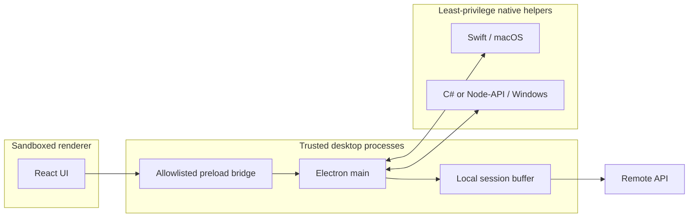

# Mirror Architecture

This document records the initial production-oriented boundary design for the desktop application.

## Repository layout

```text
Mirror/
├── apps/
│   └── desktop/                 Electron application
│       └── src/
│           ├── main/            Trusted orchestration process
│           │   ├── capture/     Platform adapters and helper transport
│           │   ├── ipc/         Allowlisted renderer operations
│           │   └── session/     Focus Session lifecycle
│           ├── preload/         Narrow contextBridge API
│           └── renderer/        React + TypeScript UI
├── packages/
│   └── contracts/               Runtime-validated cross-process contracts
├── native/
│   ├── macos-capture/           Swift system-capture helper
│   └── windows-capture/         C#/.NET system-capture helper
└── docs/                        Architecture and decisions
```

## Trust boundaries



The renderer is treated as untrusted. It has no Node.js integration and cannot spawn processes or access native APIs. The preload bridge exposes only typed Focus Session operations. Native helpers run as separate processes, receive commands over stdin, and emit newline-delimited JSON over stdout.

## Native helper protocol

All commands and responses are defined in `@mirror/contracts` and validated at runtime.

Commands:

- `start` with a Focus Session UUID;
- `stop`;
- `permissions`;
- `ping`.

Messages:

- `status` for helper lifecycle and permissions;
- `event` containing one normalized capture event;
- `error` containing a stable error code and safe message.

Platform-specific payloads are allowed only inside `event.payload`. Identity, session, time, event type, platform, and source fields remain stable across platforms.

## Scaling rules

1. New renderer features use the preload API; they do not import Electron or Node.js directly.
2. New system-capture capabilities are added behind `CaptureAdapter`.
3. Cross-process data changes begin in `@mirror/contracts` and include validation tests.
4. Native helpers never receive authentication tokens or backend credentials.
5. Raw capture data is buffered locally per session and uploaded only through a dedicated backend gateway.
6. Analysis, storage, and sync remain outside the capture layer so each can evolve independently.

## Next architectural slices

- encrypted local event store with retention policies;
- backend gateway with resumable session upload;
- permissions onboarding for macOS and Windows;
- screenshot capture behind an explicit per-session capability;
- application and website blacklist enforcement before persistence;
- structured observability with privacy-safe diagnostics;
- signed and packaged native helpers for production distribution.
